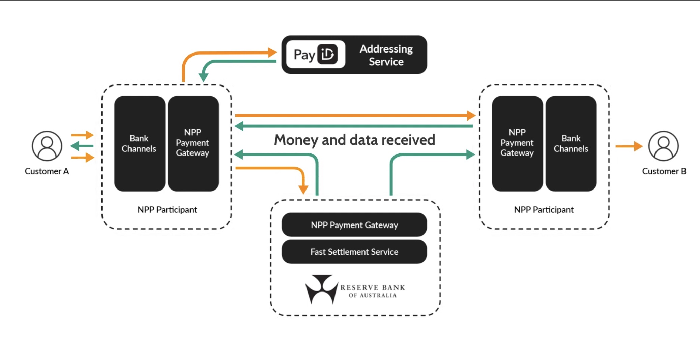

# New Payment Platform Australia (NPPA) Pty Ltd
## Maintaining and developing national infrastructure supporting real-time data-rich payments for the Australian digital economy.

&nbsp;
### **About the Company**
New Payment Platform Australia ([NPPA](https://nppa.com.au/)) is the Australian FinTech operating in the Financial Payments domain responsible for maintaining and developing the New Payment Platform (NPP) to ensure it evolves to meet the future needs of the payment industry, consumers and businesses. 

New Payments Platform or NPP as it is known, is the payment platform that enables the real time payments across different financial entities in Australia with OSKO&copy; PayID being the well known use case of the platform.

The platform is jointly owned by 13 financial organisations consisting of mainly big banks such as ANZ, Commonwealth Bank of Australia, NAB, Westpac, CitiBank, HSBC and few others. 

&nbsp;
### **Origin**
In the year 2011, an era where the smartphone innovations were at peak and Australian consumer had a processing power of a computer within their palm in form of a smart phone which was expected to get smarter and powerful with faster internet speeds, Reserve Bank of Australia (RBA) began the formal consultations for the Strategic Review of Innovation in the Payment Systems.  

In February 2012, RBA formed the board with the main focus on identifying the current potential gaps in the payment system and how it could be improved.  The key gaps noted being:

- Transmission of Data with Payments  - Inability to integrate data with payments which resorts to less efficient payment mechanism and having separate data and payments which requires reconciliation at a later stage.
- Use (or lack of use) of standards - Standards varied considerabily between between banks in terms of payment mechanism and security standards with no underlying standardisation across financial entities
- Timelines of Payments - Lack of real time retail payments transfer between merchant and user and in betweeen the banks

The board concluded in June of the same year, with the aim of delivering the following strategic objectives for the next generation payment system:
- same-day settlement of all Direct Entry payments
- the ability to make real-time retail payments
- the ability to make and receive low-value payments (Direct Entry, real-time payments and crediting of card payment receipts) outside normal banking hours
- the ability to send more complete remittance information with payments 
- the ability to address payments in simple manner.

The above objectives were to be achieved through a platform that would provide real-time retail payments and real-time funds availability.  RBA concluded that rather than a web of bilateral links between few banks, this could be achieved through a development of centralised payment hub and thus the concept of National Payments Platform was born.

Based on the findings and conclusions of the Strategic Review of Innovation in the Payment Systems, a Real-Time Payments Committee (RTPC) was formed consisting of number of industry representatives.  The Committee submitted a proposal recommending a ‘layered architecture’ for payments clearing and settlement, that could offer a wide range of new real-time payment services to consumers, businesses and government agencies. Following this proposal, KPMG was enganged to coordinate the NPP Program and the industry effort to bring the NPP to life.

NPP Australia Limited was formed in August 2014 to oversee the build, operation and management of the Platform and in September 2016, Adrian Lovney was appointed as the inaugural CEO.

The NPP went live in November 2017, supporting payments first between a small number of employees working at the initial participating financial institutions. These institutions commenced rolling out services to their customers on Tuesday, 13 February 2018 and the first official payment made on the NPP was a donation to the Alannah and Madeline Foundation Charity for Children.

Since then a vibrant ecosystem of participating financial institutions have commenced rolling out NPP-enabled payments to their retail, business and corporate customers.

&nbsp;
### **Business Actitivities**
The company's primary objective is to keep evolving the NPP for enabling real-time payments with simple addressing mechanism for e.g. using PayID (information such as an email address, phone number, ABN number or a unique organisational identifier that can be linked to a user’s bank account) and running the platform 24 hours a day, 365 days a year.

The main financial revenue is generated through the fees of being a participant in in the platform (retail, corporate and institutional banking) who in turn providing real-time payment service to their end users.  

Outside of the banking institutions, the industries such as insurance, superannuation, ecommerce, payroll, the gig economy can use the platform and provide real-time payments and each transaction on the platform also generates the transaction fees that is payable to the company which adds to their revenue.

The main customers of the company can be grouped as below:
- NPP Participant - Organisations that clear and settle payments on behalf of their customers.  The main types of customer in this category are the banking institutions.
- NPP Connected Institution - A ‘Connected Institution’ is an organisation that could connect directly to the NPP to initiate payments with participating financial institutions (when this messaging capability is available). This could include organisations like payroll providers or share registries. 
- NPP Overlay Service Provider - An Overlay Service is a product or service that uses the NPP’s capabilities in a way that defines a unique payment experience or process.  This would be organisations who provide business improvement processes, compliance or ‘Regtech’ solutions.
- NPP End User - End users or businesses who make make and recieve payments by creating a PayID with their participating financial institutions.

&nbsp;
### **Technologies and Framework Used** 
There are four main components of the technology that is used by the company.
1. The Platform - The NPP Platform is a distributed switch of individual ‘Payment Access Gateways’ that route and exchange financial messages between each other.  The financial messages are based on the [ISO20022](www.iso20022.org) which has messaging capabilties that can support 280 characters of structured or unstructured data. The ISO 20022 message schema captures and transmits this data in a way that can be customised for different payment types.  Payments can be directed to BSB and account numbers or to a PayID (information such as an email address, phone number, ABN number or a unique organisational identifier that can be linked to a user’s bank account)
2. The Fast Settlement Service (FSS) - The FSS is provided by the Reserve Bank of Australia. This capability enables every single payment made on the Platform, regardless of its size, to be settled in real-time in central bank funds between each financial institution’s Exchange Settlement Account (ESA).
3. NPP Addressing Service - More commonly known as PayID in Australia which allows users to link easy-to-remember pieces of information, such as their phone number or email address, to their account.
4. Business Services - NPP Business Services are designed to meet different payment needs. They can be used by third parties in a variety of ways and incorporated into product and service offerings ‘outside’ the Platform. A common set of rules for each service define how payment messages are processed between participating financial institutions, enabling standardisation across the network.

In addition, the platform is enhanced with the API capabilities based on the NPP API Framework which defines the key technical approach and mandatory data attributes for NPP APIs, aligned to ISO 20022 standards.  

The below image shows the communication and message exchange between different components and entities to enable the real-time payments.

&nbsp;
### **Results and Metrics**
As at Oct 25, 2021: 
- **105** Participating Financial Institutions
- **2.8mn** Average daily NPP transactions
- **~$3 billion** Average daily value of NPP payments
- **8.7mn** Number of registered PayIDs
- **$19.8bn** Largest single transaction across the NPP since launch
- **$2.6tn+** Total cumulative value of NPP payments since launch
- **31% share** Of all account to account credit payments
&nbsp;
### **Recommendations**
The company has well defined roadmap including but not limited to as below and have wide use cases already in the making:
- PayTo - Customer authorised payments initiated by third parties (similar to direct debit but without using the BSB and Account Details) (end of June 2022)
- International Payments - Safer, faster inbound international payments with complete payer information (end of April 2023) 

However as a recommendation, I would suggest them to tie up with major ERP payroll providers like SAP whose Payroll ERP solution is used across all the public sector and all the biggest private employers in Australia.

This would enable them to provide a solution for millions of Australian workers to have their pay processed through National Payment Platform and reap the benefits of real-time payments.  

Organisations processing payroll through SAP would internally use NPP and can  provide daily earned wages to the employee rather than traditional methods of payments at the end of monthly or fortnightly payroll cycle.  Every day, a worker completes a work and that day's pay is processed through the organisation payroll provider like SAP which would then use the NPP to process the payment real time in the worker's bank account enabling them to access their wage early and easily.  

This would help the workers financially but also organisations to provide more benefits to their employees in terms of real-time daily payment.  The NPPA would also benefit from increased transactions on the platform which would mean increased revenue and more investment into the betterment of the platform.

&nbsp;
### Sources:

